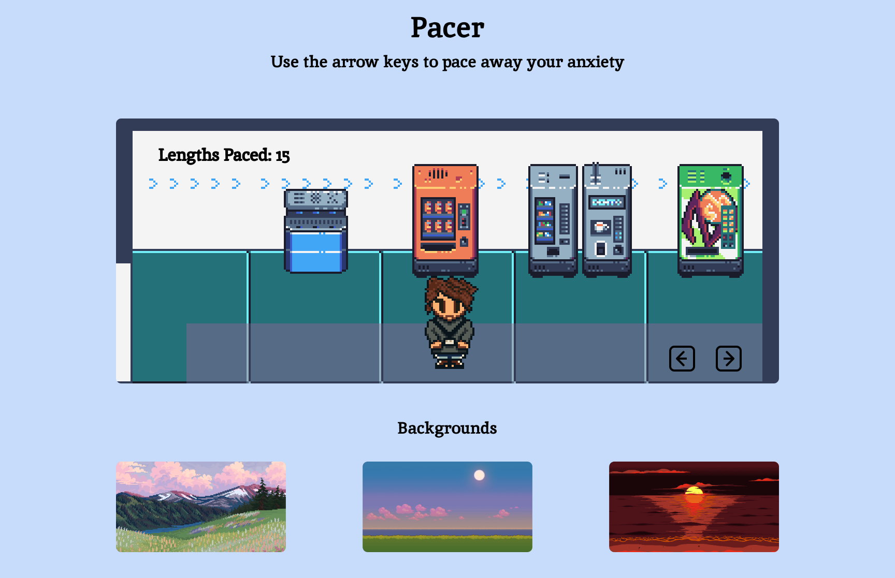

# Pacer

## Useless Website Documentation

Owen Laing

Domain: TBD

Github: <https://github.com/code-owen/pacer>

### Description

Control a character sprite and pace around different settings to work off your anxiety when you can’t physically do so.
The result will look like classic 16-bit side scrolling video games such as Contra and Super Mario where you control a 16-bit character on the screen in an environment.

---

### Animation/Interactivity

The main focus of pacer is the game screen and character sprite. The sprite will have an
idle animation when it's not being controlled. You can control the sprite using the arrow
keys. The sprite will have a left and right walking animation that will occur when the
corresponding arrow key is pressed. When an arrow key is pressed the arrow key in the
game screen will be highlighted. When the sprite completes a length of the screen (from
the farthest left and farthest right of the game screen) the "Lengths Paced” counter will
be updated.
The user will also have the option to choose different backgrounds to pace in. The
background cards will have hover animations. When a background is selected the
current background and the one selected will switch, with the current background
occupying the space of the selected background.

---

### Technology

- HTML
- CSS
- Javascript
